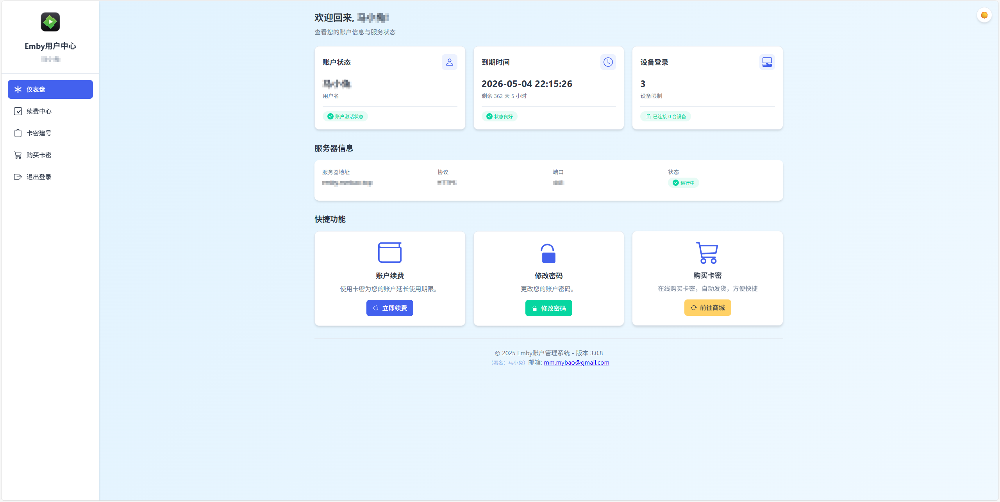
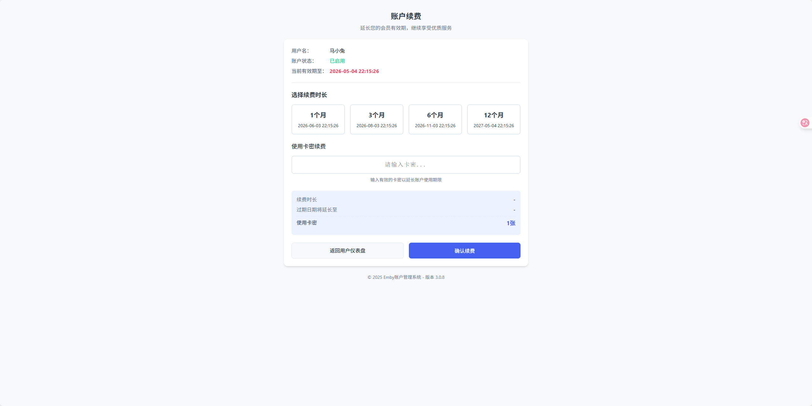
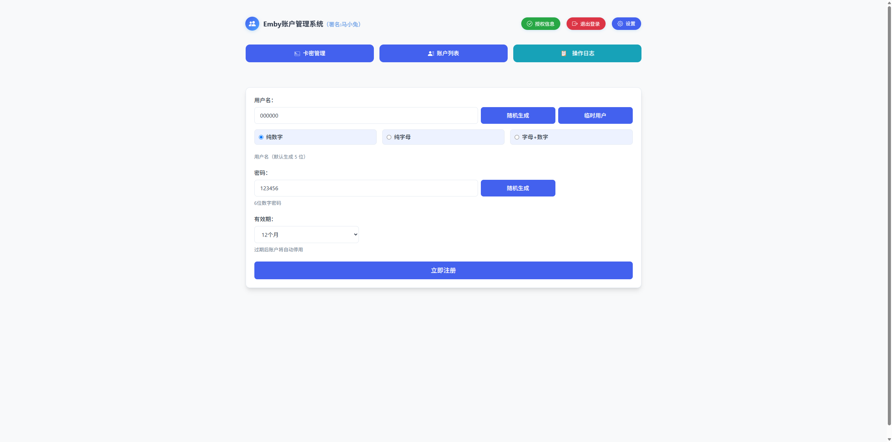
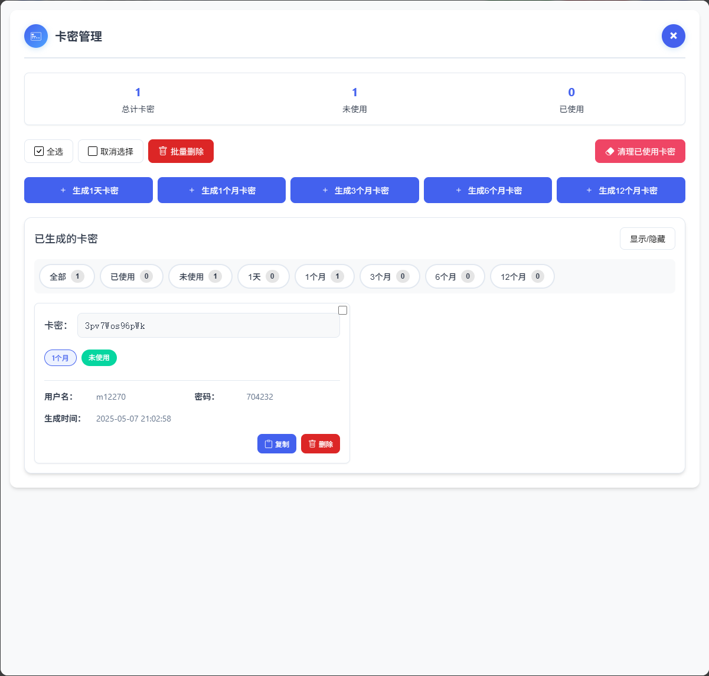
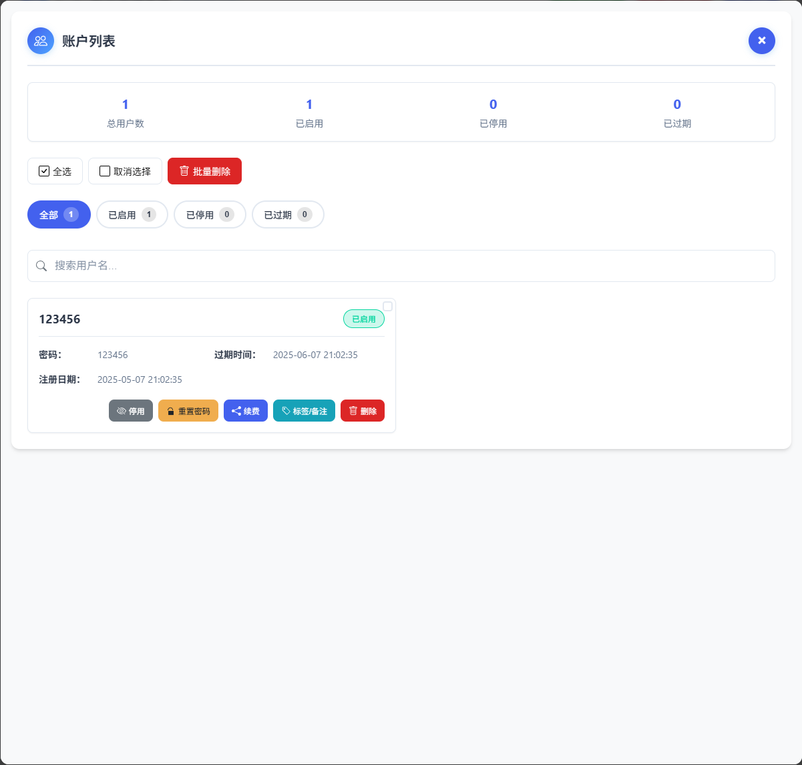

# EmbyUserHub 存储库概述

## 项目简介

EmbyUserHub 是一款专为 Emby 服务器管理员开发的轻量级用户管理系统，集成了卡密激活、自动化管理和用户控制面板等功能，让媒体服务器管理工作变得轻松高效。
## 版本(v3.1.4)的主要更新
- 🔄 ** 用户中心修改密码/用户管理重置密码**
  - 错误的代码造成修改密码/重置密码 密码为空的问题

## 版本(v3.1.3)的主要更新
### 🔄 功能增强与错误修复
- ✨ **管理员续费功能优化**
  - 支持管理员直接为用户续费，无需使用卡密
  - 注意事项：续费操作不可撤回，请谨慎确认续费信息

- 🎨 **用户体验改进**
  - 支持注册时使用自定义有效期(1-365天)
  - 支持注册时使用6-12位字母或数字组合密码
  - 改进已知页面布局问题
- 🐛 **问题修复**
  - 修复用户中心的显示错误
  - 修复用户中心通知栏"新"标志显示异常问题
  - 修复已知的小部分错误
  
## 版本(v3.1.1)的主要更新
### 🧰 媒体中心功能优化
- 🔄 **媒体库页面**
  - 新增媒体库页面，集中展示所有媒体内容 
- ✨ **分页显示功能**
  - 优化最新媒体内容的分页显示机制
  - 每页显示数量，默认20项/页
  - 改进媒体数据获取方式，确保总数统计准确性
## 版本(v3.1.0)的主要更新
### 🎬用户中心仪表盘：
-  **新增功能**
  - 媒体库统计
    - 展示全部媒体总数及各类型(电影/剧集/音乐等)的统计数量
    - 直观呈现媒体库资源分布情况
  - 最近入库
    - 实时展示服务器最新添加的媒体内容
    - 支持各种媒体类型(电影/电视剧/音乐)的显示
    - 媒体海报与详情信息展示效果
    - 多重备用检索方法，确保内容获取可靠性
## 版本(v3.0.9)的主要更新
### 🌐 网络与接口优化
- ✨ **容器网络**
  - 默认使用host网络模式，提升连接性能和稳定性
  - 优化内部网络通信机制，增强与媒体服务器的交互效率

### 🔧 公告功能
- ✨ **管理功能强化**
  - 新增管理员公告管理界面，发布公告
  - 新增用户中心公告栏，展示公告页面

## 项目截图












## 核心功能

- **卡密系统**：创建有效期卡密，支持自助激活和续费，卡密创建用户
- **用户管理**：基于模板用户权限复制，支持批量操作和标签备注
- **自动化功能**：自动检查过期用户，定时清理数据，状态同步
- **安全特性**：支持两步验证，安全访问码保护，登录失败限制
- **通知功能**：支持 Bark 推送多种事件通知（到期、续费、激活）
- **用户中心**：用户自助管理中心，支持修改密码、查看卡密、续费等功能
- --**支持卡密创建用户**：支持卡密创建用户，方便管理员管理和维护

## 配置系统

EmbyUserHub提供了灵活的配置系统，配置的加载优先级如下：
1. 环境变量（优先级最高）
2. 配置文件config.py（次优先级）
3. 默认配置（优先级最低）

使用前配置config文件：
- Emby服务器配置
- EMBY_SERVER
- ADMIN_TOKEN
- TEMPLATE_USER_ID

## Docker部署方式

```bash
# 拉取最新镜像
docker pull mmbao/embyuserhub:latest

# 运行容器
docker run -d \
  --name embyuserhub \
  --restart always \
  --network host \
  -v "/opt/embyuserhub/data:/app/data" \
  -v "/opt/embyuserhub/config:/app/config" \
  -e TZ=Asia/Shanghai \
  -e FLASK_SECRET_KEY=C1J-xvthNycHDWODaHZdJMEO--ToI5j6q3G4fKJyThc \
  -e ENABLE_SECURITY_ACCESS=True \
  -e CRON_MODE=thread \
  mmbao/embyuserhub:latest
```
## Flask Secret Key 配置说明

Flask secret key 用于会话安全和其他加密功能，这个密钥应当保密且应该是随机、复杂的字符串。

建议使用以下命令生成安全密钥：
```bash
python3 -c "import secrets; print(secrets.token_urlsafe(32))"
```

然后使用生成的值替换上面 Docker 命令中的 `FLASK_SECRET_KEY` 环境变量。

## 配置文档

详细的配置选项和说明已移至 [CONFIG.md](CONFIG.md) 文件中，包括：

- **基础配置**：服务器端口、访问控制、安全设置
- **Emby 服务器设置**：服务器地址、API密钥、模板用户配置
- **卡密系统配置**：卡密规则、有效期设置、创建用户规则
- **通知系统**：Bark推送设置、事件触发条件
- **自动化任务**：定时任务配置、清理规则
- **安全设置**：两步验证、访问码机制、登录限制参数

所有配置项均可通过环境变量、config.py文件或系统默认值进行设置，请参考配置文档进行个性化调整。

## 开发与贡献

EmbyUserHub 马小兔制作：
- 许可证需支持提供

## 维护与支持

- **作者**：马小兔
- **联系方式**：maxiaotu.mm@gmail.com
- **Docker Hub**：mmbao/embyuserhub

## 支持与捐赠

如果您觉得本项目对您有所帮助，欢迎扫描以下二维码进行捐赠支持，让开发者能够提供更好的服务和功能：

<div align="center">
  
  
</div>

---

**EmbyUserHub** - 让您的Emby管理更简单、更高效！
